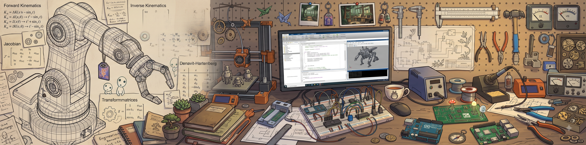
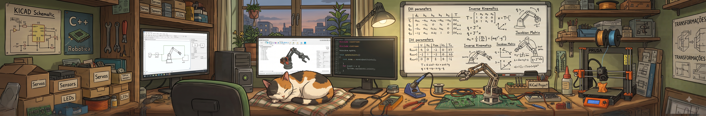

<div align="center">



# Bruno Soares Rodrigues

**Engenharia de Computação @ UFU · Maker · Autodidata**
*onde o software encontra o hardware*

<a href="https://www.linkedin.com/in/bruno-soares-655b261b4/"></a>
<a href="https://www.instagram.com/bruno.s0103/"></a>


</div>

---

## 🛠️ Sobre a bancada

Estudo **Engenharia de Computação na UFU** (3º período), mas boa parte do que sei veio de bancada suja de solda: ler datasheet, errar, queimar um componente, entender por quê e tentar de novo.

Me interesso pelo ponto onde as camadas se encontram: um **ESP32** conversando com um **app Android**, um **braço SCARA** desenhando com caneta, um **display** recebendo bitmap pixel a pixel. Gosto de projeto que se mexe, acende ou desenha.

```cpp
// bruno.cpp
struct Maker {
  const char* nome    = "Bruno";
  const char* foco    = "Software + Sistemas Embarcados";
  const char* modo    = "autodidata, aprendendo construindo";
  const char* ocupado = "robótica, cinemática e PCBs no KiCad";
};
```

---

## 🔧 Projetos em destaque

<table>
<tr>
<td width="50%" valign="top">

### 🚗 Carrinho Kamikaze — uma saga em versões
Um mesmo projeto reconstruído três vezes, cada vez com uma stack diferente:

| Versão | Cérebro | Controle |
|:--|:--|:--|
| [**V2**](https://github.com/Bruno0103/CarrinhoKamikaseV2) | ESP8266 | Site (HTML) |
| [**V3**](https://github.com/Bruno0103/CarrinhoKamikaseV3) | ESP32 | App Android (Kotlin) |
| [**V4**](https://github.com/Bruno0103/CarrinhoKamikaseV4) | ESP32 | React Native (TypeScript) |

*Aprendizado: iterar em cima do que já funciona.*

</td>
<td width="50%" valign="top">

### ✍️ Plotter Pen com sistema SCARA
[**Plotter-pen**](https://github.com/Bruno0103/Plotter-pen) · C++
Uma impressora plotter de caneta baseada em braço SCARA, onde a cinemática direta e inversa deixam de ser fórmula no quadro e viram traço no papel.

### 🖥️ ESP8266 + ST7735 (bitmap)
[**ESp8266-ST7735-bitmap**](https://github.com/Bruno0103/ESp8266-ST7735-bitmap) · C++
Exibição de imagens em um display TFT com ESP8266. Já tem fork da comunidade. ⭐

</td>
</tr>
</table>

---

## 🧰 Ferramentas da oficina

<div align="center">


<br>


</div>

---

## 📐 Estudando agora

- **Robótica**: cinemática direta e inversa, Denavit–Hartenberg, matrizes de transformação e Jacobianas
- **Eletrônica**: projeto de PCBs com KiCad
- **Integração**: firmware ⇄ app ⇄ web, tudo conversando na mesma rede

---

## 📊 Números da bancada

<div align="center">

<a href="https://github.com/Bruno0103">
  
</a>
<a href="https://github.com/Bruno0103?tab=repositories">
  
</a>

</div>

---

<div align="center">



*Todo bom projeto precisa de um supervisor de qualidade que dorme no meio da bancada.* 🐈

</div>
